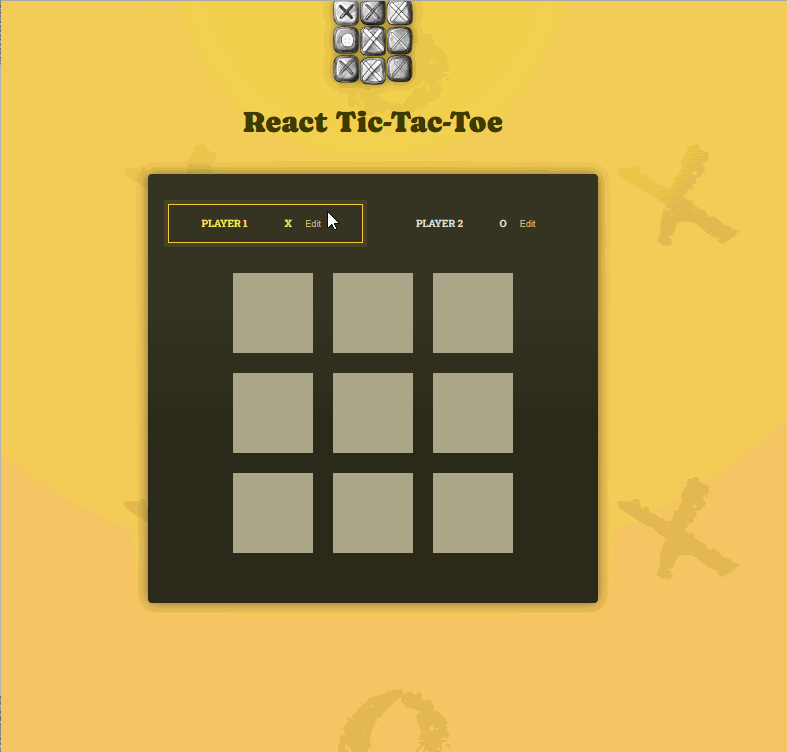

# Tic-Tac-Toe Game (React)

This is a simple Tic-Tac-Toe game built using React. The project was created to practice essential React concepts like state management, components, and event handling.



## Features

- Play a classic Tic-Tac-Toe game
- Interactive UI with real-time updates
- Tracks the winner or a draw
- Built with React functional components and hooks

## Installation

1. Clone the repository:

   ```sh
   git clone https://github.com/Manar-Moh/react-game-tic-tac-toe.git
   cd react-game-tic-tac-toe
   ```

2. Install dependencies:

   ```sh
   npm install
   ```

3. Start the development server:

   ```sh
   npm start
   ```

4. Open your browser and go to `http://localhost:3000` to play the game.

## How to Play

- The game is played on a 3x3 grid.
- Two players take turns marking `X` or `O` in an empty square.
- The first player to get three marks in a row (horizontally, vertically, or diagonally) wins.
- If all squares are filled and no player has won, it's a draw.

## Technologies Used

- React (with Hooks)
- JavaScript (ES6+)
- CSS (for styling)

## Contributing

Feel free to fork this project and improve upon it! Pull requests are welcome.

## License

This project is open-source and available under the MIT License.


